# InventarioAPI — CI/CD Pipeline

## Integrantes del equipo

- Isabel Johana Hoyos Echavarría

---

## Videos de evidencia

| Actividad | Enlace |
|---|---|
| Integración Continua (CI) | _(pendiente)_ |
| Entrega Continua (CD) | _(pendiente)_ |

---

## Descripción del proyecto

**InventarioAPI** es una API RESTful para la gestión de inventario de productos, desarrollada con ASP.NET Core (.NET 10). Permite crear, consultar, actualizar y eliminar productos del inventario mediante endpoints REST documentados con Swagger.

### URL de la aplicación desplegada

| Componente | URL |
|---|---|
| API (Swagger) | https://inventario-api-b3esfdhqbvgzcmfa.centralus-01.azurewebsites.net/swagger |

---

## Fechas de despliegue

| Evento | Fecha |
|---|---|
| Primer despliegue CI/CD | 14 mayo 2026 |
| Último despliegue exitoso | 16 mayo 2026 |

---

## Actividad 1: Integración Continua (CI)

### Herramientas utilizadas

- Visual Studio 2026 / .NET 10
- GitHub (control de versiones)
- Azure DevOps (pipeline CI/CD)

### Pipeline — `azure-pipelines.yml`

El pipeline se activa automáticamente con cada push a la rama `main`:

| Paso | Descripción |
|---|---|
| `UseDotNet@2` | Instala el SDK de .NET 10 en el agente |
| `DotNetCoreCLI@2` build | Compila el proyecto en modo Release |
| `DotNetCoreCLI@2` publish | Publica el proyecto y genera el artefacto `.zip` |
| `PublishBuildArtifacts@1` | Sube el artefacto `drop` a Azure DevOps |
| `AzureWebApp@1` | Despliega automáticamente en Azure App Service (CD) |

---

## Actividad 2: Entrega Continua (CD)

### Infraestructura en Azure

| Recurso | Valor |
|---|---|
| Resource Group | `rg-inventario` |
| Región | Central US |
| App Service | `inventario-api` |
| Sistema operativo | Windows |
| Plan | Free F1 |
| Runtime | .NET 10 |

### Flujo de despliegue automático

1. Se realiza un `git push` a la rama `main` en GitHub
2. Azure DevOps detecta el cambio y dispara el pipeline CI automáticamente
3. El pipeline compila el proyecto y genera el artefacto `.zip`
4. El Release Pipeline detecta el nuevo artefacto y dispara el CD automáticamente
5. El Stage 1 despliega la aplicación en Azure App Service sin intervención manual
6. La aplicación queda disponible en la URL de Azure

---

## Endpoints de la API

| Método | Ruta | Descripción |
|---|---|---|
| GET | `/api/productos` | Retorna todos los productos |
| GET | `/api/productos/{id}` | Retorna un producto por ID |
| POST | `/api/productos` | Crea un nuevo producto |
| PUT | `/api/productos/{id}` | Actualiza un producto |
| DELETE | `/api/productos/{id}` | Elimina un producto |

---

## Evidencias paso a paso

### Paso 1 — Estructura del proyecto en Visual Studio

Se creó el proyecto ASP.NET Core Web API con .NET 10 en Visual Studio 2026. La estructura incluye el controlador de productos, el modelo `Producto.cs`, `Program.cs` y el archivo `azure-pipelines.yml`.

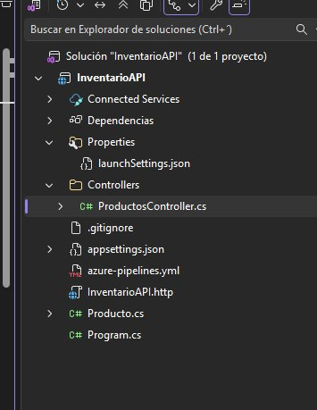

---

### Paso 2 — Swagger UI ejecutándose localmente

Se verificó que la API funciona correctamente en el entorno local en `localhost:7171/swagger`.

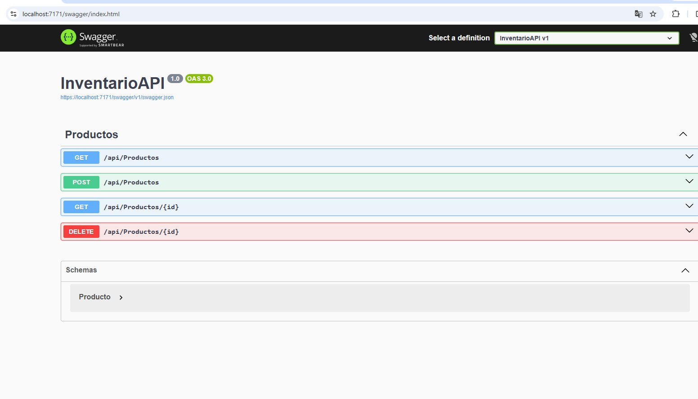

---

### Paso 3 — Primer commit desde la terminal Git

Se inicializó el repositorio Git y se realizó el primer commit vinculando el repositorio local con GitHub.

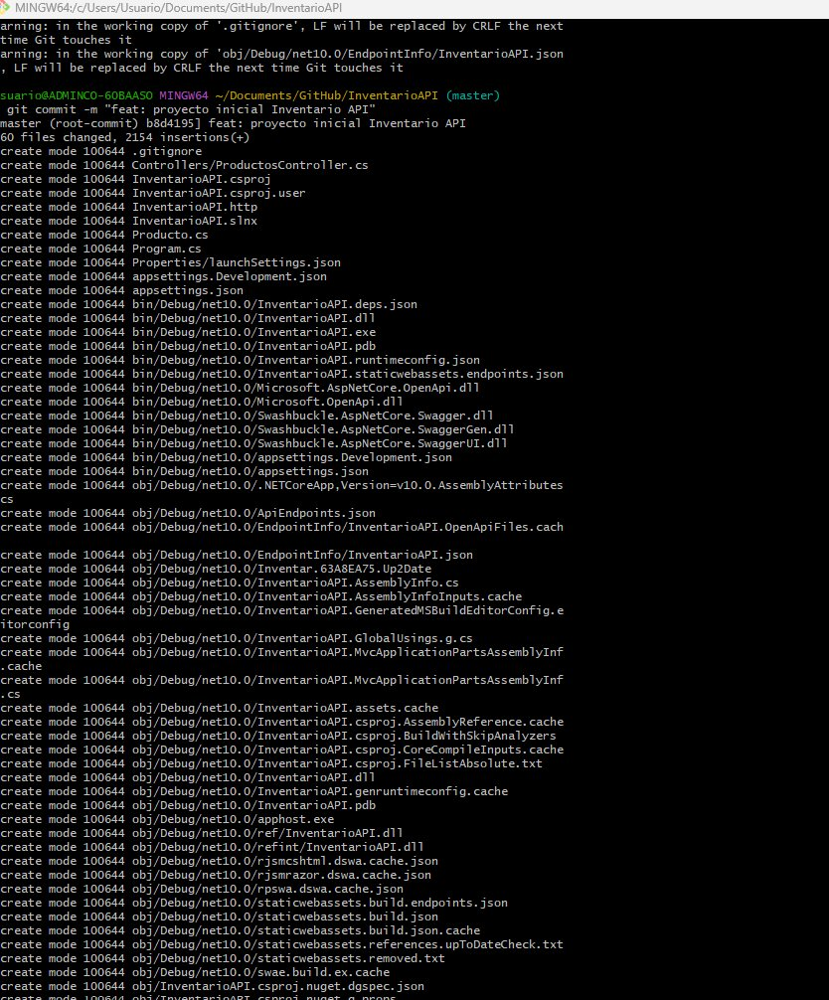

---

### Paso 4 — Configuración del archivo azure-pipelines.yml

Se configuró el pipeline CI/CD con el archivo YAML en Azure DevOps. El comentario `# ── CI: Integración Continua` marca el inicio del proceso de integración continua.

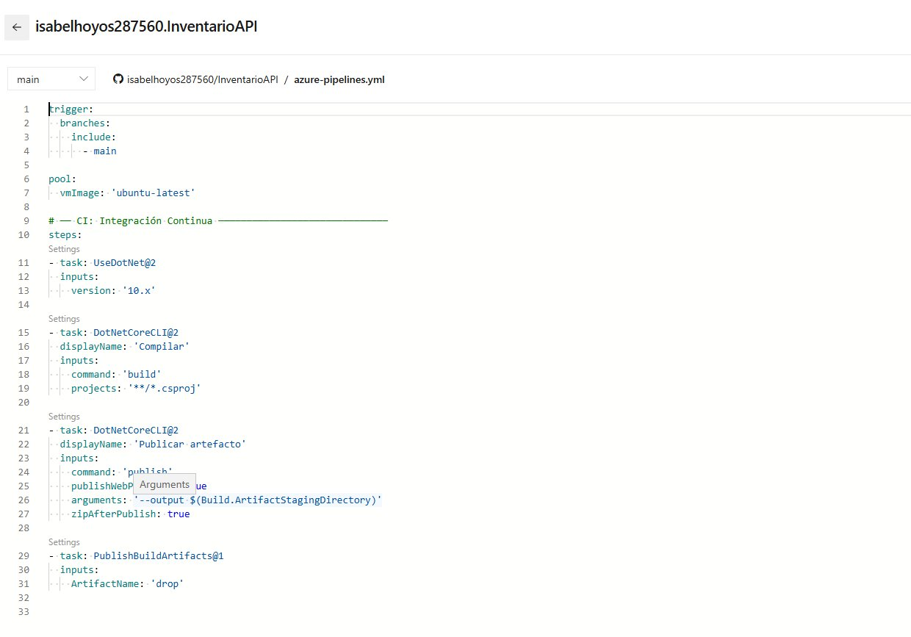

---

### Paso 5 — Pipeline creado en Azure DevOps

Se creó el proyecto `InventarioAPI` en Azure DevOps y se conectó al repositorio de GitHub.

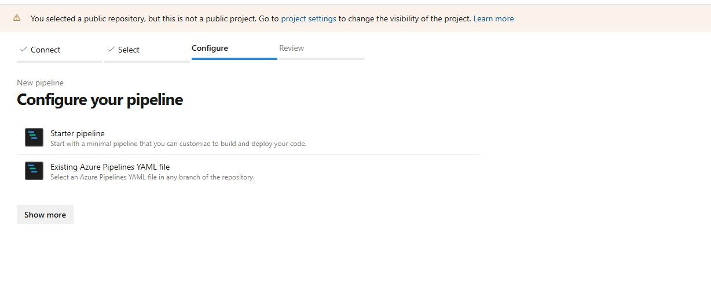

---

### Paso 6 — Ejecución exitosa del pipeline CI

Al hacer push a la rama `main`, el pipeline se disparó automáticamente y completó todos los pasos exitosamente: UseDotNet, Compilar, Publicar artefacto.

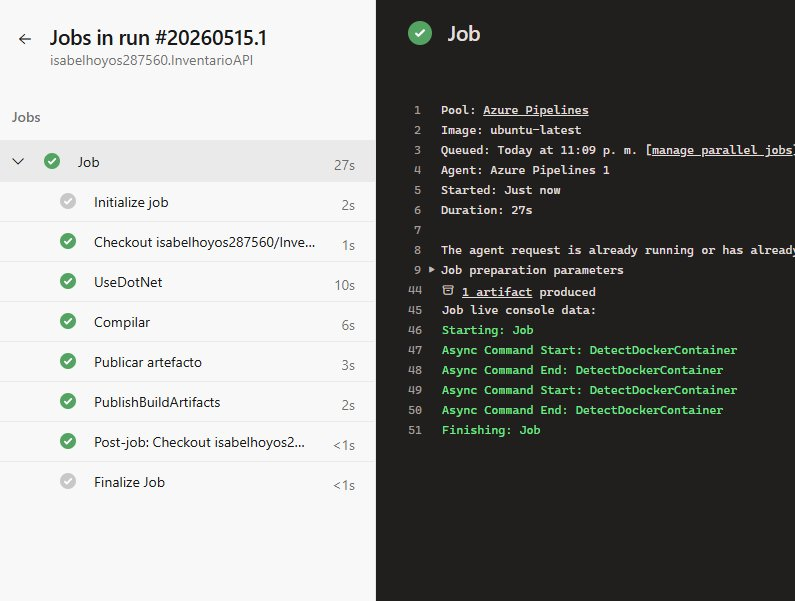

---

### Paso 7 — Historial de ejecuciones del pipeline

Múltiples ejecuciones exitosas del pipeline CI/CD incluyendo commits de diferentes integrantes del equipo. Todos los runs en verde confirman el correcto funcionamiento del flujo automatizado.

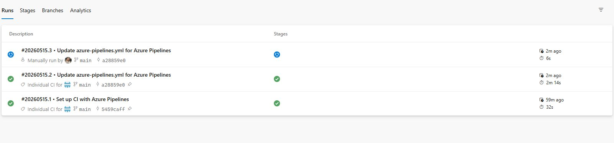

---

### Paso 8 — Artefacto generado

El pipeline generó exitosamente el artefacto `drop` con el `.zip` listo para despliegue en Azure.

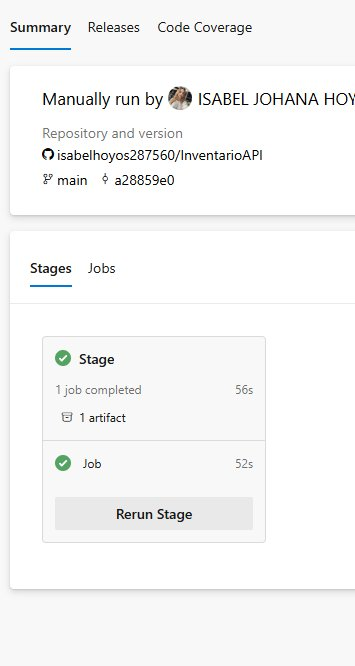

---

### Paso 9 — Creación del App Service en Azure Portal

Se creó el App Service `inventario-api` en Azure Portal con el plan Free F1, Windows y región Central US.

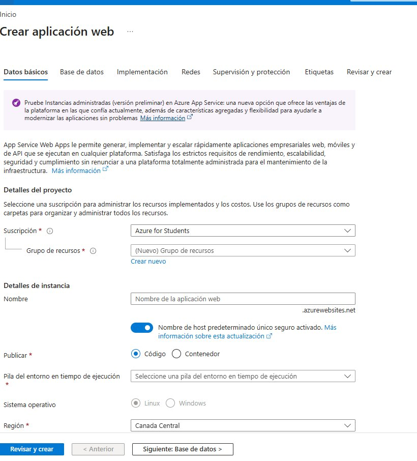

---

### Paso 10 — Implementación del App Service exitosa

Azure confirmó la creación exitosa del App Service y el plan de servicio `ASP-rginventario`.

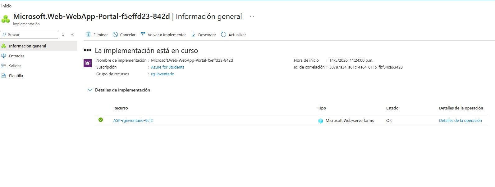

---

### Paso 11 — Service Connection configurada

Se configuró la Service Connection `Azure for Students` en Azure DevOps con verificación exitosa para conectar el pipeline con la suscripción de Azure.

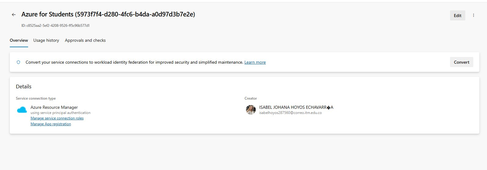

---

### Paso 12 — Pipeline de despliegue completo

Vista del task `Azure App Service Deploy` configurado en el Release Pipeline con la Service Connection y el App Service correctamente vinculados.

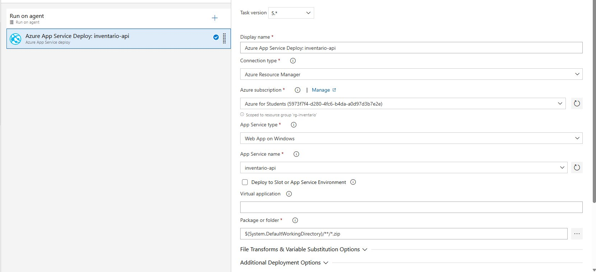

---

### Paso 13 — Swagger UI en producción

La aplicación está desplegada y funcionando en Azure con todos los endpoints disponibles en la URL de producción.

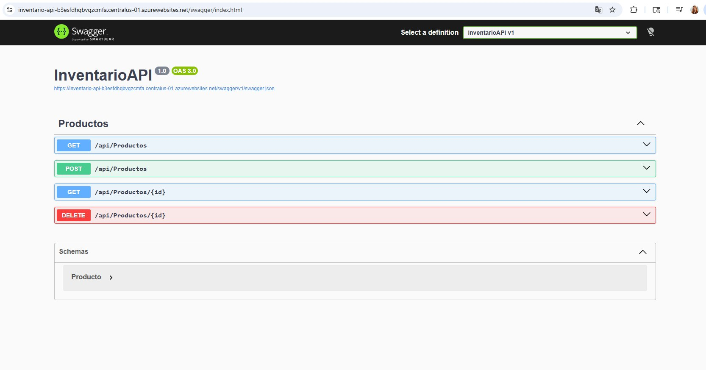

---

### Paso 14 — Release Pipeline con despliegue automático exitoso

El Release-6 muestra el despliegue completamente exitoso. El trigger **Continuous deployment** se activó automáticamente con el artefacto `20260516.6` y el **Stage 1 Succeeded**, confirmando el flujo CD sin intervención manual.

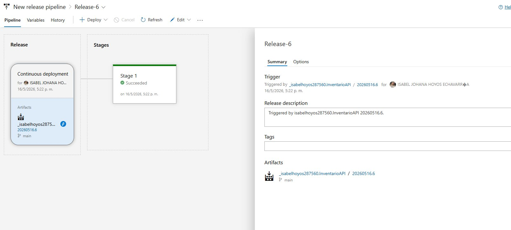

---

### Paso 15 — Historial de releases exitosos

Los releases Release-4, Release-5 y Release-6 muestran el Stage 1 completado exitosamente en verde, evidenciando el funcionamiento continuo del CD con cada commit.

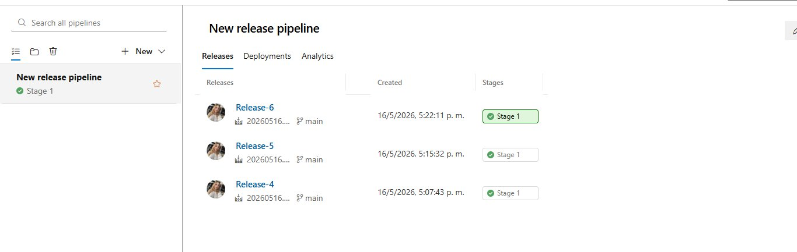

---

## Resolución de errores

### Error 1 — App Service no disponible en Canada Central con Linux

**Descripción:** Al crear el App Service con Linux en Canada Central, Azure retornó error de capacidad no disponible.

**Solución:** Se cambió la región a Central US y el sistema operativo a Windows.

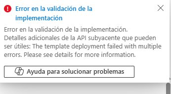

---

### Error 2 — Agente 'Hosted Windows 2019 with VS2019' descontinuado

**Descripción:** El Release pipeline fallaba con `No image label found to route agent pool Hosted Windows 2019 with VS2019`.

**Solución:** Se cambió el Agent pool a `Azure Pipelines` con Agent Specification `windows-2022`.

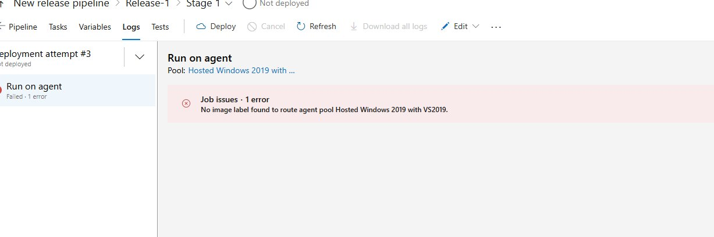

---

### Error 3 — Push rechazado por divergencia con repositorio remoto

**Descripción:** Git rechazó el push porque Azure DevOps había commiteado `azure-pipelines.yml` directamente en GitHub.

**Solución:** Se ejecutó `git pull --rebase` para integrar los cambios remotos antes del push.

---

## Estructura del repositorio

```
InventarioAPI/
├── Controllers/
│   └── ProductosController.cs
├── Evidencias/
├── Properties/
├── .gitignore
├── appsettings.json
├── appsettings.Development.json
├── azure-pipelines.yml
├── InventarioAPI.csproj
├── InventarioAPI.http
├── InventarioAPI.slnx
├── Producto.cs
├── Program.cs
└── README.md
```

---

## Colaboradores

Repositorio compartido con: `orlandoalarconperez@outlook.com`
